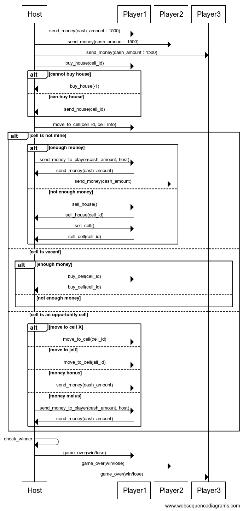

# Règles

Le jeu se joue à au moins deux joueurs et au maximum à six joueurs. L'un des joueurs est désigné comme maître du jeu et gère la banque ainsi que les titres de propriété et les ventes de biens.

## Le Plateau

Le plateau de jeu du Monopoly se compose de 40 cases. Il y a différents types de cases :

- la case Départ
- les propriétés ou terrains (groupés par couleur)
- les gares
- les services publics
- la prison et la case "allez en prison"

[Source de l'image](http://www.monopolypedia.fr/editions/france/classique2014/classique2014.php)

## Mise en place

Chaque joueur se voit attribuer un pion qui est placé sur la case "Départ" et commence la partie en recevant 1500€. La partie se joue avec une paire de dés à six faces.

## Déroulé de la partie

Pour commencer la partie, chaque joueur lance les dés. Les joueurs jouent dans l'ordre des scores obtenus, celui ayant fait le score le plus haut commence.
Le maitre du jeu vérifie si la partie est terminée. Si c'est le cas, il en informe chaque joueur.

## Déroulé d'un tour

Chaque joueur lance les dés et avance son pion sur la case correspondante. En fonction de la case, il y a alors plusieurs possibilités :

| Statut de la case                  | Actions                                                                                                                                                                                                                                                                                                                                                                                                                                       |
|------------------------------------|-----------------------------------------------------------------------------------------------------------------------------------------------------------------------------------------------------------------------------------------------------------------------------------------------------------------------------------------------------------------------------------------------------------------------------------------------|
| Case libre                         | Le terrain/la gare/le service public n'appartient à personne. Le joueur peut, s'il le souhaite, en devenir propriétaire.                                                                                                                                                                                                                                                                                                                      |
| Case appartenant à un autre joueur | Si le joueur tombe sur cette case, il doit payer le loyer demandé. Dans le cas où il n'aurait pas assez d'argent, il doit vendre un de ses biens.                                                                                                                                                                                                                                                                                             |
| case appartenant au joueur         | Aucune action n'est requise.                                                                                                                                                                                                                                                                                                                                                                                                                  |
| Case "Allez en prison"             | Le pion du joueur est placé sur **la case Prison**                                                                                                                                                                                                                                                                                                                                                                                            |
| Case Prison                        | Le joueur doit attendre 3 tours en lançant les dés à chaque tour pour essayer de faire un double. Si le joueur fait un double, il sort de prison en utilisant le lancer de dés pour avancer. Si, après les 3 tours, il n'a pas fait de double, il doit payer 50€ à a banque et bouger son pion suivant le lancer de dés. Il peut aussi choisir de payer directement les 50€ sans attendre 3 tours et lancer les dés pour avancer normalement. |
| Case Chance                        | Le joueur obtient un malus (exemple : payer 300€ à la banque) ou un bonus (exemple: obtenir 200€ de la part de la banque ou avancer jusqu'à la case Départ). L'événement est décidé aléatoirement.                                                                                                                                                                                                                                            |
| Case Départ                        | Si le joueur passe ou s'arrête sur cette case, il obtient 200€ de la part de la banque.                                                                                                                                                                                                                                                                                                                                                       |

À chaque tour, si le joueur possède tous les terrains d'une même couleur, il peut décider de construire une nouvelle maison sur un des terrains. Le joueur peut construire jusqu'à 4 maisons par terrain. La construction doit se faire uniformément sur les terrains d'une même couleur : il n'est pas possible de construire une deuxième maison sur un terrain bleu si les autres terrains bleus n'ont pas tous une maison.

Chaque maison ajoutée sur le terrain augmente sa valeur immobilière et donc le prix du loyer pour les autres joueurs. Le fait de construire une maison ne termine pas le tour du joueur.

## Fin de la partie

La partie s'arrête lorsque le dernier joueur est en situation de monopole, c'est-à -dire que tous les autres joueurs ont fait faillite.

# Détail des classes principales

* MonopolyHost classe exécutable représentant le maitre du jeu
* MonopolyGuest classe exécutable représentant un adversaire du maitre du jeu
* MonopolyStandAlone jeu local.

# Protocole réseau

